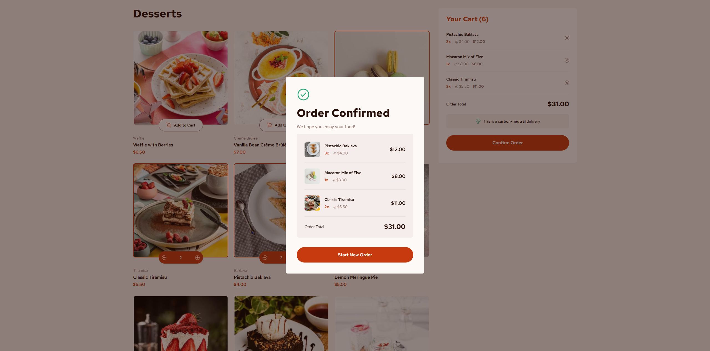

# Frontend Mentor - Product list with cart solution

This is a solution to
the [Product list with cart challenge on Frontend Mentor](https://www.frontendmentor.io/challenges/product-list-with-cart-5MmqLVAp_d).
Frontend Mentor challenges help you improve your coding skills by building realistic projects.

## Table of contents

- [Overview](#overview)
    - [The challenge](#the-challenge)
    - [Screenshot](#screenshot)
    - [Links](#links)
    - [Features](#features)
- [My process](#my-process)
    - [Built with](#built-with)
- [Author](#author)

## Overview

### The challenge

Users should be able to:

- Add items to the cart and remove them
- Increase/decrease the number of items in the cart
- See an order confirmation modal when they click "Confirm Order"
- Reset their selections when they click "Start New Order"
- View the optimal layout for the interface depending on their device's screen size
- See hover and focus states for all interactive elements on the page

### Screenshot

### Links

- Solution URL: [Frontend Mentor]()*
- Live Site URL: [Netlify]()*

### Features

- Interactive Cart System: Add, remove, and update item quantities dynamically with real-time cart total calculation
- Order Confirmation Modal: Once the order is placed, a confirmation popup summarizes all selected items with their
  quantities and prices
- Responsive Design: Works seamlessly across desktop and mobile devices, ensuring a smooth user experience
- Product Display Grid: Showcases desserts with images, names, categories, and prices in a visually appealing card
  layout
- Dynamic Pricing: Cart updates automatically as users change item counts
- Modern UI Elements: Buttons, hover effects, and transitions for a polished shopping feel
- Carbon-Neutral Delivery Tag: A small UI detail that makes the app look professional and realistic

## My process

### Built with

- Semantic HTML5 markup
- CSS custom properties
- Flexbox
- CSS Grid
- Mobile-first workflow
- JS

## Author

- GitHub - [leviral](https://github.com/leviral)
- Frontend Mentor - [@leviral](https://www.frontendmentor.io/profile/leviral)